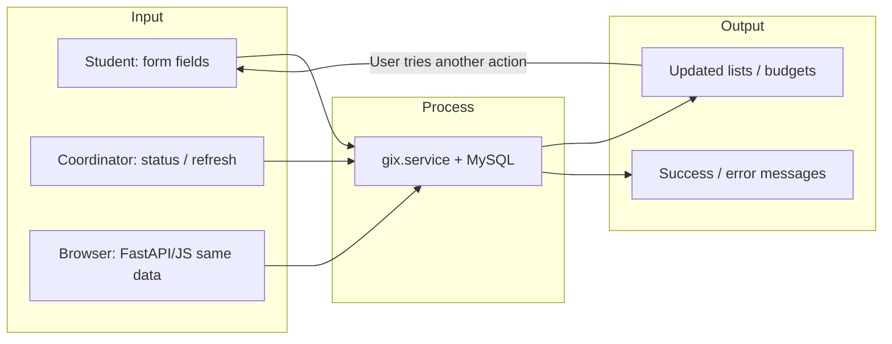
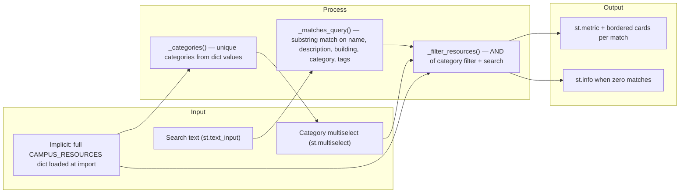

# Week 1 Lab — Submission worksheet

**Course repo:** [https://github.com/GIX-Luyao/lab-1-alanliu2003](https://github.com/GIX-Luyao/lab-1-alanliu2003)  
**How to run (short):** See `[README.md](README.md)` — Docker: `docker compose up --build -d` — Local: `pip install -r requirements.txt`, `.env` from `.env.example`, `python init_db.py`, then `streamlit run streamlit_app.py` and/or `python -m uvicorn api.main:app --host 0.0.0.0 --port 8000`.

---

## Component A — Staff interview

### Individual interview notes

**Direct quotes (1–2):**  
“Sometimes students find it difficult to navigate the excel sheets, and sometimes they send in empty requests.”

**Surprises:**  
Our current data is kept by the primitive excel method.

**Current workarounds:**  
Using an excel sheet as data base.

**What success looks like (their words):**  
Students can navigate easily and communicate with the director.

**User journey (ordered steps + time / where info lives / what can go wrong):**  

1. **Student decides the team needs to buy something** — *Time:* minutes to hours (depends on class). *Info lives:* syllabus, team chat, instructor guidance. *Can go wrong:* unclear what is allowed to purchase or budget limits.
2. **Student (often CFO) gathers details** — link, price, quantity, team number, approval. *Time:* ~5–20 minutes. *Info lives:* shopping site, team notes, email threads. *Can go wrong:* missing fields; later shows up as an “empty” or incomplete request.
3. **Student submits the request** — today via email and/or filling cells in a shared Excel sheet. *Time:* a few minutes if the sheet is clear; longer if columns or tabs are confusing. *Info lives:* inbox + spreadsheet on a shared drive. *Can go wrong:* wrong row, wrong tab, or blank cells — aligns with *“sometimes they send in empty requests.”*
4. **Coordinator sees the submission** — opens email or checks the sheet. *Time:* same day to 1–2 days (inbox load, meetings). *Info lives:* email + Excel. *Can go wrong:* message buried; duplicate entries; version conflicts if two people edit the sheet.
5. **Coordinator validates and records** — checks budget/class rules, may fix or chase missing info. *Time:* ~5–15 minutes per request (more if back-and-forth). *Info lives:* Excel + memory of policy + possibly instructor confirmation. *Can go wrong:* spreadsheet out of date; hard to see *who* submitted *what* for *which* class at a glance.
6. **Coordinator places or approves the order** — external vendor or internal process. *Time:* hours to days. *Info lives:* vendor site, PO system (if any), email. *Can go wrong:* order held up because the original row was incomplete.
7. **Coordinator updates status and communicates back** — student expects to know if the item is ordered or arrived. *Time:* intermittent updates. *Info lives:* email replies + Excel status column. *Can go wrong:* status not updated; student keeps asking — friction with *“communicate with the director.”*
8. **Student / team acts on delivery** — picks up or uses the item. *Time:* varies. *Info lives:* email, signs, or in-person. *Can go wrong:* mismatch between what was ordered and what teams thought they requested.

**Why this maps to the app you built:** The Streamlit **Student** page captures structured fields (reducing empty requests), and the **Coordinator** view supports **status** and **budget** visibility so steps 5–7 have a clearer system of record than a fragile Excel-only loop.

### Problem statement (one sentence)

> When **GIX student teams and the Program Coordinator (Student Purchasing)** need to **submit and track purchase requests (who, what, class, cost, and status)**, they currently **use a shared Excel sheet plus email**, which causes **hard-to-navigate spreadsheets, empty or incomplete submissions, slow back-and-forth, and no single clear place to see status or budgets.**

**Your sentence (same idea, submission-ready):**  
When GIX student teams and the Program Coordinator need to submit and track purchase requests, they currently use a shared Excel sheet and email, which causes confusing navigation, empty or incomplete requests, delayed communication, and weak visibility into who ordered what and where each request stands.

**Aligned with this codebase (how your app addresses it):**  

> When **GIX student teams and the program coordinator** need to **submit and track purchase requests with budgets**, they currently **rely on scattered email and spreadsheets**, which causes **delays, unclear status, and hard-to-audit spending.**

---

## Component B — Lab build & AI workflow

### App summary (what you built)

- **Name / purpose:** GIX team purchase tracker — students submit purchases; coordinator updates status and sees budgets.
- **Stack:** Streamlit (multipage), FastAPI + JavaScript UI, MySQL, Docker optional.
- **Main Streamlit entry:** `streamlit run streamlit_app.py` (not `app.py`).

### AI usage log (≥ 3 interactions)


| #   | Prompt (summary)                            | What the AI produced | First try? | What you fixed / learned |
| --- | ------------------------------------------- | -------------------- | ---------- | ------------------------ |
| 1   | *[YOUR: e.g. initial build prompt]*         | *[YOUR]*             | *Y/N*      | *[YOUR]*                 |
| 2   | *[YOUR: e.g. add MySQL / coordinator flow]* | *[YOUR]*             | *Y/N*      | *[YOUR]*                 |
| 3   | *[YOUR: e.g. Docker / accessibility]*       | *[YOUR]*             | *Y/N*      | *[YOUR]*                 |
| 4+  | *[optional]*                                |                      |            |                          |


### Accessibility baseline

**Check 1 — Color contrast (WCAG ≥ 4.5:1)**  

- **Method:** Browser DevTools → text + background hex → [WebAIM Contrast Checker](https://webaim.org/resources/contrastchecker/).  
- **Result:** *[YOUR: Pass / Fail]*  
- **Element checked:** *[e.g. body text on default Streamlit theme]*  
- **If fail, what you changed:** *[YOUR or N/A]*

**Check 2 — Semantic headings**  

- **Result:** *[YOUR: Pass / Fail]*  
- **Evidence in repo:** One `st.title()` per page in `streamlit_app.py`, `pages/1_Student.py`, `pages/2_Coordinator.py`; sections use `st.header()` / `st.subheader()` (Coordinator: “Team budgets”, “Purchases”; Student: “Purchase information”). No `st.write("## …")` for titles.  
- **If you changed anything:** *[YOUR or “Adjusted heading hierarchy per lab.”]*

### Level 4 — Manual change & file comment

**Change you made by hand (no AI):**  
*[YOUR: e.g. label text, column layout, sample data row]*

**Suggested top-of-file comment** (add to `streamlit_app.py` or your chosen main file if not already there):

```python
# GIX team purchase tracker — Streamlit home page.
# Students use sidebar pages to submit purchases; coordinator reviews in MySQL-backed UI.
# I manually changed: [YOUR one line].
```

### Reflection (3–5 sentences each — for PDF / Canvas)

1. **What surprised you about AI-assisted coding?**
  *[YOUR]*
2. **What did the AI get wrong? How did you fix it?**
  *[YOUR]*
3. **Could you explain one section of your code to a classmate without Cursor?**
  *[YOUR]*
4. **What did you learn from Dorothy’s interview? How did it change what you built?**
  *[YOUR]*

---

## Component C — System architecture & design

### Input–Process–Output diagram (Streamlit / main app)

**Describe or attach a photo/PDF of your drawing.** Below is a text reference you can copy or redraw.




**Feedback loop (label):** *[e.g. Coordinator changes status → sees new budget → edits another row]*

### Design decision log


| Field                                  | Your entry                                                                                                                                |
| -------------------------------------- | ----------------------------------------------------------------------------------------------------------------------------------------- |
| **Decision**                           | Split UI into Streamlit multipage app (`streamlit_app.py` + `pages/`), FastAPI + `frontend/` for JS, and `gix/` for shared DB logic.      |
| **Alternatives considered**            | Single `app.py`; only Streamlit; only FastAPI.                                                                                            |
| **Why you chose this**                 | Meets lab Streamlit requirement while supporting a separate JS coordinator view; shared `gix/service.py` avoids duplicating budget rules. |
| **Trade-off**                          | More files and two runtimes to document; Docker compose runs both + MySQL.                                                                |
| **When would you choose differently?** | If the course required only Streamlit, you might drop FastAPI and keep a single stack.                                                    |


**Lab question:** *Why one file vs many?*  
*[YOUR: agree/disagree with table above in your own words — 2–3 sentences]*

---

## Component D — Testing & validation (smoke test)

**App command used:** `streamlit run streamlit_app.py` *(and/or note Docker URL)*.


| #   | Feature tested         | Action you took                                        | Expected result                             | Actual result | Pass/Fail |
| --- | ---------------------- | ------------------------------------------------------ | ------------------------------------------- | ------------- | --------- |
| 1   | Student submit form    | Fill team, CFO, link, price, qty; submit               | Purchase saved; success message             | *[YOUR]*      | *[YOUR]*  |
| 2   | Coordinator status     | Open Coordinator page; change status to Arrived; Apply | Status updates; budget changes when Arrived | *[YOUR]*      | *[YOUR]*  |
| 3   | App loads / navigation | Open home; use sidebar to Student & Coordinator        | Pages load without traceback                | *[YOUR]*      | *[YOUR]*  |


**Screenshot:** *[YOUR: attach to PDF — path in repo optional, e.g. `docs/screenshot-streamlit.png`]*

**Failures:** *[YOUR: None / describe fix]*

### Quality gate checklist

- Smoke test table completed (3 features)
- Failures fixed or documented
- Screenshot included in submission PDF
- Accessibility results recorded above

---

## Component E — GIX Wayfinder (required by manual)

**In this repo:** multipage Streamlit app → sidebar page **GIX Wayfinder** (`pages/3_Wayfinder.py`), dictionary data in `gix/wayfinder_data.py` (`CAMPUS_RESOURCES`).

### Wayfinder I/P/O

**Data flow:** in-memory dictionary (source) → Python filter/search logic → Streamlit UI (cards or empty-state message).




**One-sentence summary:** The user’s query and category choices are **inputs**; the app **processes** them against the local `CAMPUS_RESOURCES` dictionary; **output** is either a list of resource cards or a clear “no matches” message.

### Implementation notes

- **Data structure:** `dict[str, dict]` — keys are resource ids (`makerspace`, `bike_storage`, …); each value holds `name`, `category`, `building`, `description`, and optional `tags` (`list[str]`). Defined in `gix/wayfinder_data.py`.  
- **Search / filter:** Sidebar search string (case-insensitive substring) and optional category multiselect; empty category selection means “all categories.”  
- **Empty results:** `st.info(...)` explains that nothing matched and suggests clearing filters or shortening the search.

### Edge cases (2)

**Extra ideas you can use for a third row or discussion:** very long search string; special characters in search (e.g. `@`, `#`); selecting every category vs. none; refreshing the page (session resets — data is not persisted).


| Edge case                                                                                   | Why it matters                                                                                                         | What you tested                                                                                                | Result                     |
| ------------------------------------------------------------------------------------------- | ---------------------------------------------------------------------------------------------------------------------- | -------------------------------------------------------------------------------------------------------------- | -------------------------- |
| **No matching resources** (e.g. search `zzzz` or a category combo that excludes every item) | Users must not see a blank screen; the lab explicitly asks for this path.                                              | Enter a nonsense search and/or pick categories until the list is empty; confirm the blue info message appears. | *[YOUR: Pass/Fail + note]* |
| **Empty or whitespace-only search**                                                         | Default behavior should show “everything allowed by category filter,” not confusing partial matches from edge parsing. | Leave search blank; type only spaces; confirm all resources still show (with no category filter).              | *[YOUR: Pass/Fail + note]* |


### `assert` for data integrity

**Location in code:** `gix/wayfinder_data.py` — function `_assert_campus_resources_integrity` (assertions on resource ids and required fields); invoked at module load (~line 113).

**Example (simplified; real code loops and checks non-empty strings):**

```python
# On import, after CAMPUS_RESOURCES is defined:
_assert_campus_resources_integrity(CAMPUS_RESOURCES)
```

### Prompt log (Wayfinder)

- **Initial prompt:**   Build the requirements of Component E in the @[lab-manual.md](http://lab-manual.md), store data locally. 
- **One refinement:** Use Python dictionary to store data.
- **What changed and why:** As I was using MySQL before, it used MySQL, and was way out of scope for this simple challenge.

---

